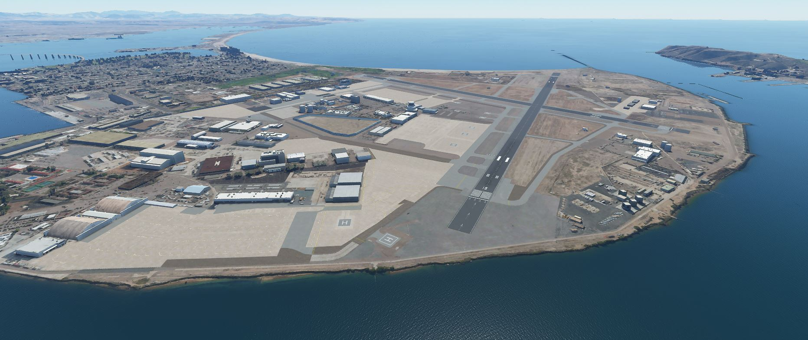
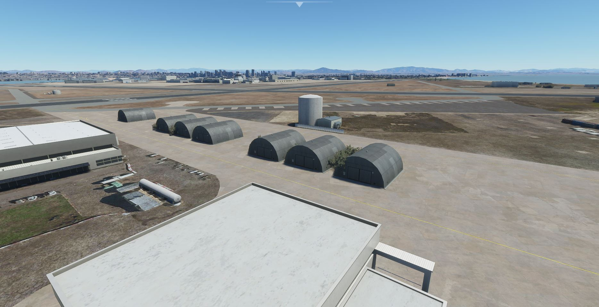
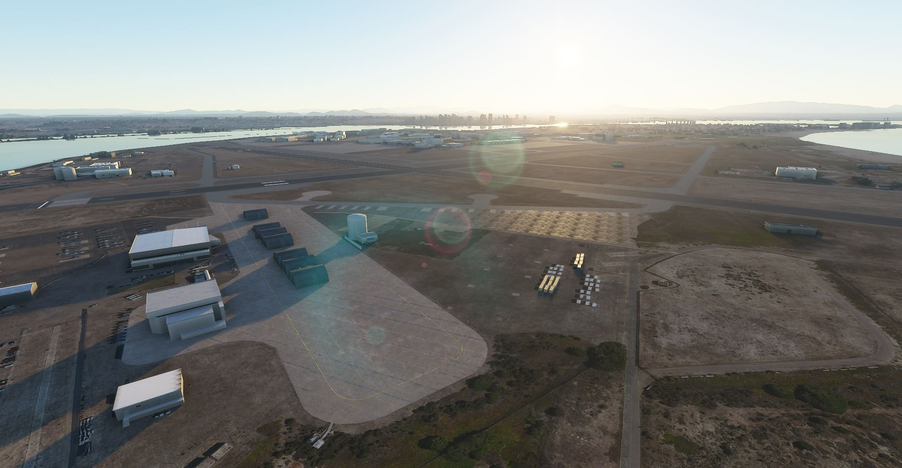
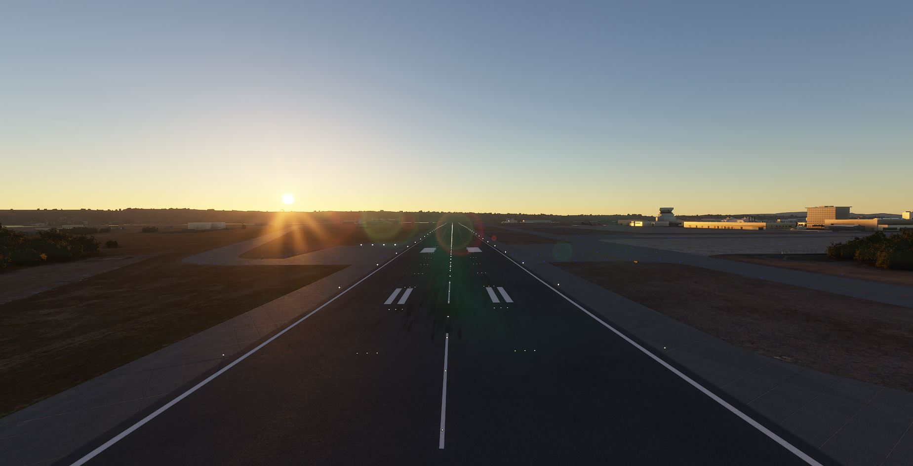

# KNZY - North Island Naval Air Station (Halsey Field)
#### Author: Julysfire
Discord: julysfire#9465        MSFS2020: blackflame0729

##### Description
KNZY Naval Air Station on North Island in San Diego.

##### Summary
This is currently a small project of mine that I will continue work on.

I am currently working on importing custom 3D photorealistic buildings and props to continue to improve this.

This is my first time making anything like this let alone in Flight Sim, will continue to work on this as I learn and go along.  This airport wasn't in the base game but is an active airfield in FSEconomy.

This is a MS2020 creation for KNZY - North Island Air Station (Halsey Field).

Wiki: <https://en.wikipedia.org/wiki/Naval_Air_Station_North_Island>

AirNav: <http://www.airnav.com/airport/KNZY>

#### ---Installation Instructions---
1. Download the .zip file from Releases (or zip file here)
2. Extract files to the your Microsoft Flight Simulator Community Folder

For the Microsoft Store edition AND/OR Gamepass edition:

	C:\Users\[YOUR USERNAME]\AppData\Local\Packages\Microsoft.FlightSimulator_<RANDOMLETTERS>\LocalCache\Packages\Community
	
For the Steam edition:

	C:\Users\[YOUR USERNAME]\AppData\Roaming\Microsoft Flight Simulator\Packages\Community
   
### Important Installation Information

Due to having custom materials, I have noticed that renaming the package (in this case julysfire-airport-knzy-northislandnas) before or after moving to the Community folder may case some textures to appear missing.  If this is the case, please make sure to name the folder "julysfire-airport-knzy-northislandnas" (no quotes).  If you have a previous version of this airport (airport-julysfire-KNZY), please remove that from your scenery folder.  The name change is to stay in line with Microsoft's naming convention.

### Release Notes

Release: V1.2

- Added a lot more 3D scenery
- TONS of Painted Lines fixes and improvment based on better pictures 
- Fixed a lot of ground textures
- Vegetation fixes
- Helipads on the taxiway fixes
- Helipad numbers

#### Screenshots

Day Time

Airfield

Topdown

Sunrise

Sunset

Night

**---TODO (in priority)---**
1. More 3D Objects, custom ones too
2. Service roads ect
3. Correct any issues/bugs that may come up

This is a new found hobby that I found I really enjoy.  If you enjoyed it as well and would like to donate, it is very much appreciated but never will be required.  I am doing this to add to the community and because I found I enjoyed it.
http://paypal.me/julysfire