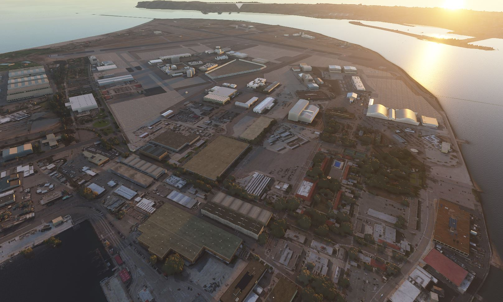

# KNZY - North Island Naval Air Station (Halsey Field)
#### Author: Julysfire
Discord: julysfire#9465        MSFS2020: blackflame0729

###### Description
KNZY Naval Air Station on North Island in San Diego.

###### Summary
This is currently a small project of mine that I will continue work on.

I am currently working on importing custom 3D photorealistic buildings and props to continue to improve this.

This is my first time making anything like this let alone in Flight Sim, will continue to work on this as I learn and go along.  This airport wasn't in the base game but is an active airfield in FSEconomy.

Wiki: <https://en.wikipedia.org/wiki/Naval_Air_Station_North_Island>

AirNav: <http://www.airnav.com/airport/KNZY>

#### ---Installation Instructions---
1. Download the .zip file from Releases (or julysfire-knzy folder here)
2. Extract files to the your Microsoft Flight Simulator Community Folder

For the Microsoft Store edition AND/OR Gamepass edition:

	C:\Users\[YOUR USERNAME]\AppData\Local\Packages\Microsoft.FlightSimulator_<RANDOMLETTERS>\LocalCache\Packages\Community.
	
For the Steam edition:

	C:\Users\[YOUR USERNAME]\AppData\Roaming\Microsoft Flight Simulator\Packages\Community.
   

#### Screenshots

All current airport designs (runways, taxiways, aprons, ect)

Day Time

Airfield

Topdown

Sunset

Night

**---TODO (in priority)---**
1. More 3D Objects, custom ones too
2. Taxiway Signs
3. Better textures
4. More parking spaces
5. Service roads ect
6. Correct any issues/bugs that may come up