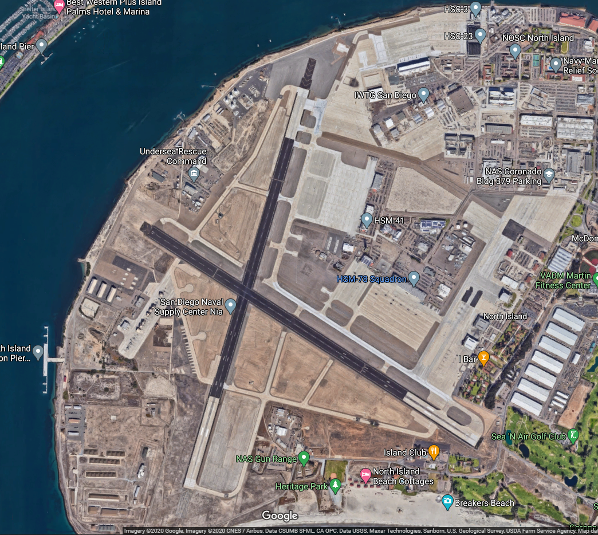

# KNZY - North Island Naval Air Station (Halsey Field)
#### Author: Julysfire
Discord: julysfire#9465        MSFS2020: blackflame0729

##### Description
KNZY Naval Air Station on North Island in San Diego.

##### Summary
This is my first time making anything like this let alone in Flight Sim, will continue to work on this as I learn and go along.  This airport wasn't in the base game but is an active airfield in FSEconomy.

This is a MS2020 creation for KNZY - North Island Air Station (Halsey Field), a AFB in the on Halsey Island in the San Diego Bay.

Wiki: <https://en.wikipedia.org/wiki/Naval_Air_Station_North_Island>

AirNav: <http://www.airnav.com/airport/KNZY>

#### ---Installation Instructions---
1. Download the .zip file from Releases (or zip file here)
2. Extract files to the your Microsoft Flight Simulator Community Folder

For the Microsoft Store edition AND/OR Gamepass edition:

	C:\Users\[YOUR USERNAME]\AppData\Local\Packages\Microsoft.FlightSimulator_<RANDOMLETTERS>\LocalCache\Packages\Community
	
For the Steam edition:

	C:\Users\[YOUR USERNAME]\AppData\Roaming\Microsoft Flight Simulator\Packages\Community
   

### Release Notes

Release: V1.6.0

- Update for World Update X
- Updated a lot of the painted lines to be more accurate
- Updated some of the textures to match newer imagery
- Fixed many broken taxi ways
- Connected all parking sppots to work with ATC and guidelines

#### Screenshots

Day Time

Airfield

Topdown

Sunrise

Sunset

Night

Google Maps

This is a new found hobby that I found I really enjoy.  If you enjoyed it as well and would like to donate, it is very much appreciated but never will be required.  I am doing this to add to the community and because I found I enjoyed it.
http://paypal.me/julysfire